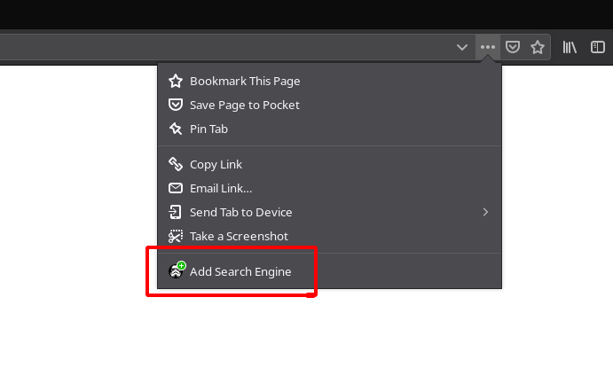

# awesome-opensearch

A list of https://developer.mozilla.org/en-US/docs/Web/OpenSearch[OpenSearch] descriptors for sites who lack of this awesome feature.

>The OpenSearch description format lets a website describe a search engine for itself, so that a browser or other client application can use that search engine. OpenSearch is supported by (at least) Firefox, Edge, Internet Explorer, Safari, and Chrome.

## How to use

1. Find a site you're looking for in the list below.
1. If it is not in the list — submit a PR!
1. Click the link.
1. Select "Add Search Engine" in the "Page Actions" dropdown:
+

## The list

- https://madhead.github.io/awesome-opensearch/deepl.com/en/ru[DeepL (en → ru)] (deepl.com)
- https://madhead.github.io/awesome-opensearch/deepl.com/ru/en[DeepL (ru → en)] (deepl.com)
- https://madhead.github.io/awesome-opensearch/plugins.gradle.org[Gradle plugins] (plugins.gradle.org)
- https://madhead.github.io/awesome-opensearch/search.maven.org[Maven Central] (search.maven.org)
